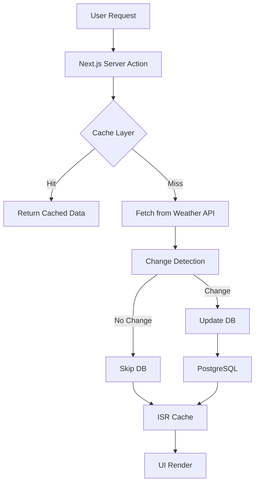

# 🌦️ Weather.IO — Performance-Optimized Weather System

A full-stack weather application built with Next.js, TypeScript, and PostgreSQL, focused on **real-world system performance, caching, and efficiency optimization** rather than just UI.

---

## 🚀 Live Demo

  https://weather-ey07179ip-shadows5-projects.vercel.app/

---

## 🧠 Why This Project Exists

Most weather apps are simple API wrappers.

This project focuses on:

* reducing latency
* optimizing backend efficiency
* designing real-world caching strategies
* understanding system bottlenecks

---

## ⚡ Performance Improvements

| Optimization                          | Impact                                              |
| ------------------------------------- | --------------------------------------------------- |
| API Caching (in-memory)               | Eliminated redundant external API calls             |
| DB Write Optimization                 | Prevented unnecessary writes using change detection |
| ISR (Incremental Static Regeneration) | Reduced page load latency from ~2.5s → ~400ms       |
| Selective Queries (Prisma)            | Reduced payload size and improved response time     |
| Conditional Cache Invalidation        | Avoided unnecessary re-renders                      |

---

## 📊 Before vs After

| Metric          | Before        | After                |
| --------------- | ------------- | -------------------- |
| Page Load Time  | ~2.5s         | ~400–500ms           |
| API Calls       | Every request | Cached (30s)         |
| DB Writes       | Always        | Only on change       |
| System Behavior | Inconsistent  | Stable + predictable |

---

## 🏗️ System Architecture

---

## 🛠️ Tech Stack

* **Frontend:** Next.js, React, Tailwind CSS
* **Backend:** Node.js, Server Actions
* **Database:** PostgreSQL (Prisma ORM)
* **Deployment:** Vercel / Render
* **Tools:** GitHub Actions, Docker (optional)

---

## 🧩 Key Engineering Decisions

### 1. Why caching?

To reduce latency and external API dependency.

### 2. Why conditional DB writes?

Database operations are expensive — unnecessary writes degrade performance.

### 3. Why ISR instead of full SSR?

To balance freshness and speed using controlled revalidation.

### 4. Why selective queries?

To minimize payload and improve response time.

---

## ⚠️ Trade-offs

* In-memory cache resets on server restart
* Weather data may be slightly stale (≤30s)
* No distributed caching (future improvement)

---

## 🚀 Future Improvements

* Redis-based distributed caching
* Background jobs for periodic weather updates
* Rate limiting per user
* Real-time updates with WebSockets

---

## 📌 What I Learned

* Performance is about identifying bottlenecks layer by layer
* Caching is easy — cache invalidation is hard
* Backend efficiency matters more than adding features
* Real-world systems require trade-offs

---

## 👨‍💻 Author

**Prathiush Arun**
Backend-Focused Full-Stack Developer

---
