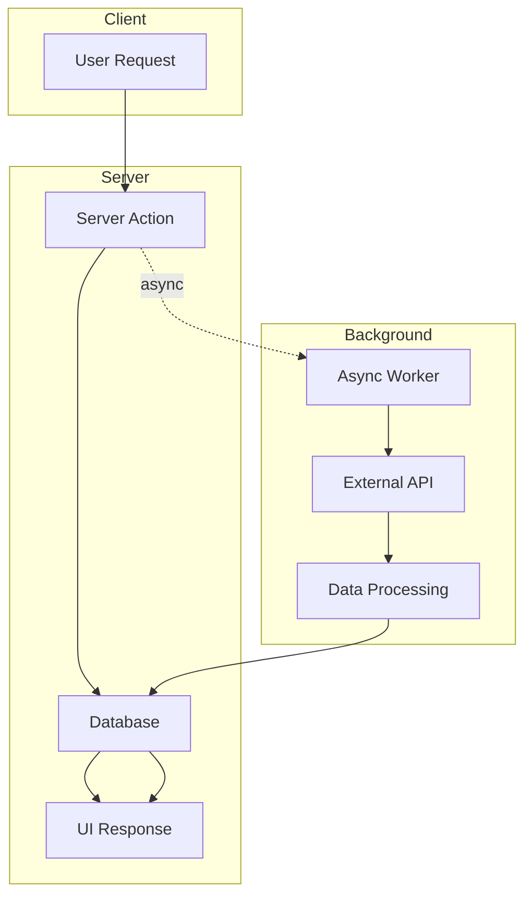

# Weather.IO — Performance Optimized Weather System

A full stack weather application built with Next.js, TypeScript, and PostgreSQL, focused on latency optimization, system design, and efficient data flow.

---

## Live Demo

https://weather-ey07179ip-shadows5-projects.vercel.app/

---

## Why This Project Exists

Most weather applications are simple API wrappers that block on external requests.

This project focuses on:

* removing API latency from the user experience
* designing a read optimized system
* applying real world caching strategies
* understanding backend performance bottlenecks

---

## Performance Metrics (Lighthouse)

### Mobile

* First Contentful Paint: 0.8s
* Largest Contentful Paint: 2.1s
* Total Blocking Time: 540ms
* Speed Index: 2.2s

### Desktop

* First Contentful Paint: 0.2s
* Largest Contentful Paint: 0.6s
* Total Blocking Time: 80ms
* Speed Index: 1.3s

---

## Before vs After Optimization

| Metric          | Before       | After          |
| --------------- | ------------ | -------------- |
| Response Time   | ~2.5s        | ~500–700ms     |
| API Calls       | Blocking     | Asynchronous   |
| Data Source     | External API | Database First |
| User Experience | Delayed      | Instant        |

---

## System Architecture

This system separates read and write paths to eliminate external API latency from user requests.



---

## Core Engineering Idea

### Traditional Approach

User waits for external API before seeing data.

### Implemented Approach

Database is treated as the primary data source. External API runs in the background.

```ts
refreshWeather(city)
```

This removes external latency from the critical request path.

---

## Architecture Overview

* Frontend: Next.js App Router, React, Tailwind CSS
* Backend: Next.js Server Actions
* Database: PostgreSQL with Prisma
* External API: OpenWeatherMap
* Rendering Strategy: Incremental Static Regeneration

---

## Key Engineering Decisions

### Database as Cache

The database is used as the primary cache layer instead of in-memory caching, ensuring persistence and consistency.

### Asynchronous Data Updates

Weather updates are performed in the background to avoid blocking user requests.

### Selective Data Fetching

Only required fields are queried to reduce payload size and improve response time.

### Controlled Revalidation

UI updates only when necessary, avoiding unnecessary re-renders.

---

## Trade-offs

* Data may be slightly stale due to asynchronous updates
* No distributed cache layer yet
* Background updates are not queued and lack retry logic

---

## Future Improvements

* Redis based distributed caching
* Background job queue for retries and scheduling
* Rate limiting per user
* Real time updates using WebSockets

---

## What This Project Demonstrates

* Understanding of latency as a system level problem
* Ability to redesign data flow for performance
* Awareness of real world trade-offs
* Practical use of caching and revalidation strategies

---

