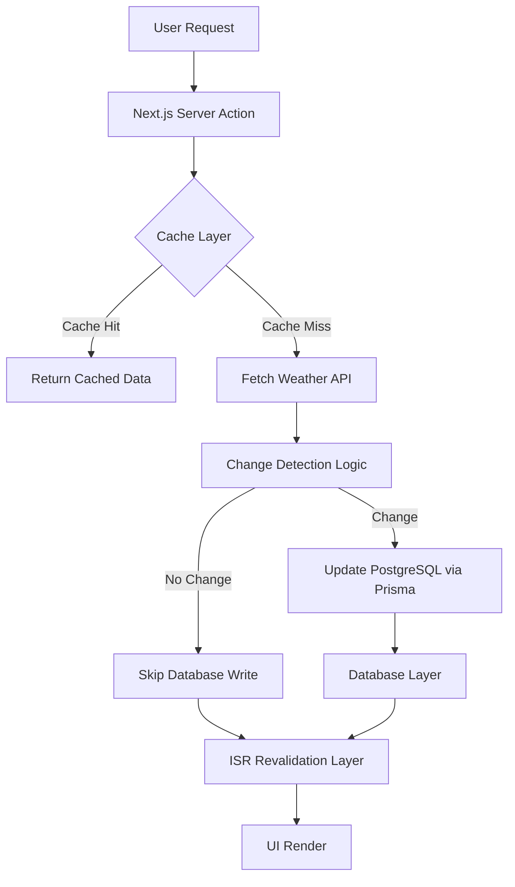

# Weather.IO — High Performance Weather System

A full stack weather application built with Next.js, TypeScript, PostgreSQL, and Prisma focused on real world system design, caching strategies, and backend performance optimization.

---

## Live Demo

https://weather-ey07179ip-shadows5-projects.vercel.app/

---

## What This Project Really Is

This is not a simple weather app.

It is a performance engineered system that focuses on:

- Reducing latency across full request lifecycle  
- Minimizing unnecessary database and network operations  
- Implementing intelligent caching logic  
- Understanding trade offs between freshness and speed  
- Designing backend systems with real world constraints  

---

## Why This Project Exists

Most weather apps:

- Fetch data from an API  
- Render it on screen  
- Stop there  

This project treats weather data as a system design problem instead of just a UI problem.

---

## Performance Metrics

### Desktop

- First Contentful Paint: 0.2 seconds  
- Largest Contentful Paint: 0.4 seconds  
- Total Blocking Time: 30 milliseconds  
- Speed Index: 0.9 seconds  
- Cumulative Layout Shift: 0  

### Mobile

- First Contentful Paint: 0.8 seconds  
- Largest Contentful Paint: 2.1 seconds  
- Total Blocking Time: 40 milliseconds  
- Speed Index: 0.8 seconds  
- Cumulative Layout Shift: 0  

---

## System Architecture

    
 ---
    
 ## Key Engineering Decisions

### Caching Strategy
Reduces external API dependency and improves response time

### Conditional Database Writes
Prevents unnecessary writes using change detection

### Server Actions
Removes API routes and reduces network overhead

### ISR Based Revalidation
Balances freshness and performance

### Selective Queries
Fetches only required fields to reduce payload size

---

## Request Lifecycle Breakdown

### 1. User Request
User triggers weather search from UI

### 2. Server Action Execution
Next.js handles request directly without API routes

### 3. Cache Evaluation
Memory cache is checked first

- Cache hit returns instantly  
- Cache miss continues execution  

### 4. External API Fetch
Weather API is called only when required

### 5. Change Detection
System compares new and stored data

- No change skips database write  
- Change triggers update  

### 6. Database Update
Only meaningful changes are written to PostgreSQL

### 7. Revalidation Layer
ISR ensures UI stays fresh without constant fetching

### 8. UI Rendering
Optimized data is rendered to user

---

## Trade Offs

- In memory cache resets on server restart  
- Slight delay in real time accuracy  
- No Redis distributed cache yet  
- Prioritizes performance over strict freshness  

---

## Why This Is More Than a Weather App

This project demonstrates production level system design thinking:

- Cache invalidation strategy  
- Database write optimization  
- Network reduction techniques  
- Backend performance engineering  
- Latency aware architecture design  

---

## System Design Highlights

### Read Optimization
Cache first strategy reduces repeated computation

### Write Optimization
Database writes only occur on actual data change

### Edge Friendly Design
Built for scalable deployment using Server Actions and ISR

### Minimal Network Dependency
Reduces API calls using caching and computation reuse

---

## Engineering Challenges Solved

### API Overfetching
Solved using cache first architecture

### Database Write Explosion
Solved using conditional writes

### Latency Spikes
Solved using server side execution

### Mobile Performance Issues
Solved using ISR and reduced payload queries

---

## Tech Stack

- Next.js App Router  
- TypeScript  
- PostgreSQL  
- Prisma ORM  
- Tailwind CSS  
- Vercel Deployment  

---

## Future Improvements

- Redis distributed caching  
- Background job system for updates  
- Rate limiting per user  
- WebSocket live updates  
- Edge caching globally  
- Observability and metrics dashboard  